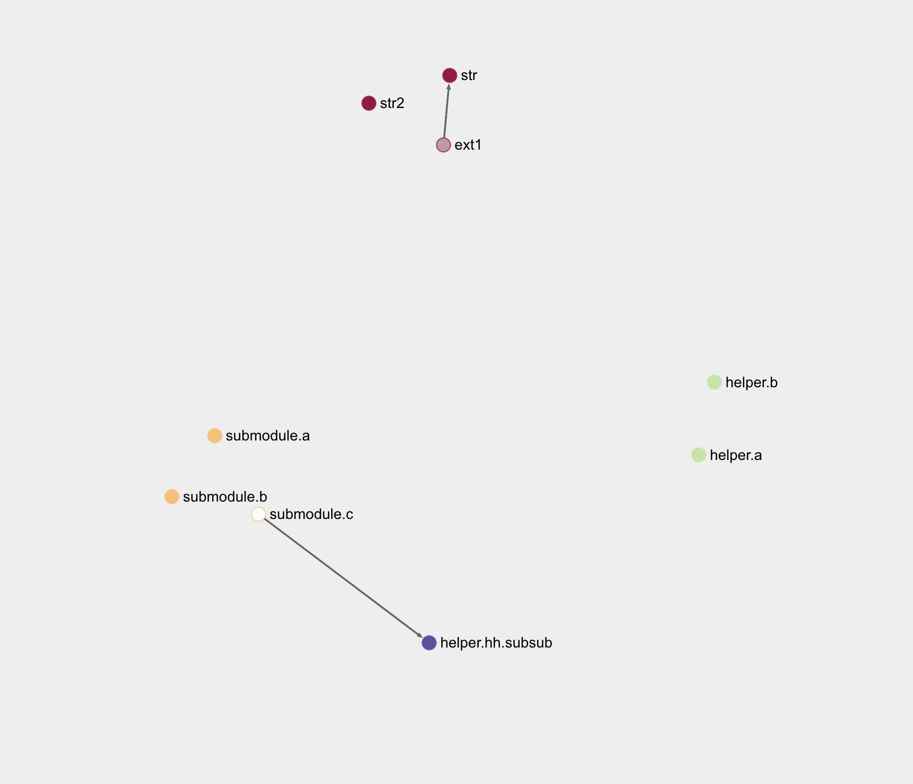

# Graph
> [!WARNING] Not Released Yet
> `@dity/graph` is coming soon.
> 
You can use `@dity/graph` to visualise your dependency graph. It can visualise all relationships between your modules without instantiating individual dependencies. This 
makes it feasible to run it on CI or to add it to your internal dashboard for quick codebase exploration.

It uses [Sigma.js](https://www.sigmajs.org/) internally to provide visuals.

